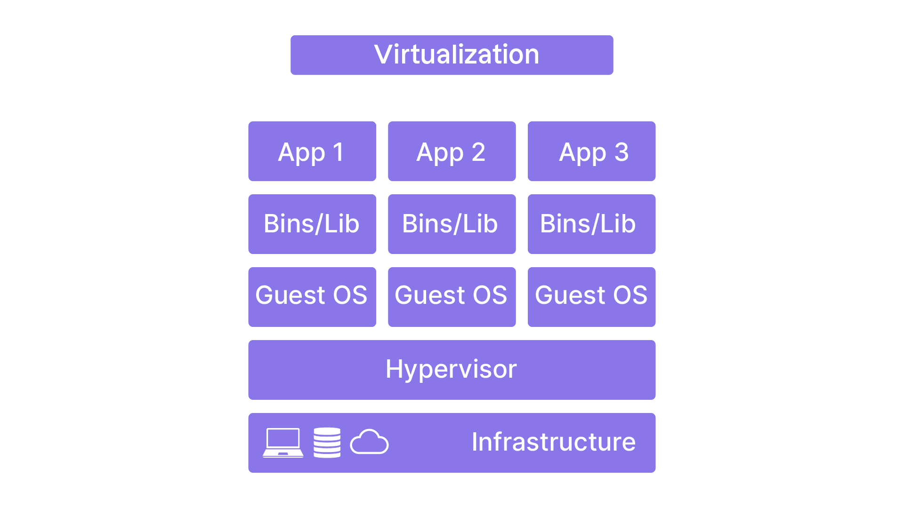
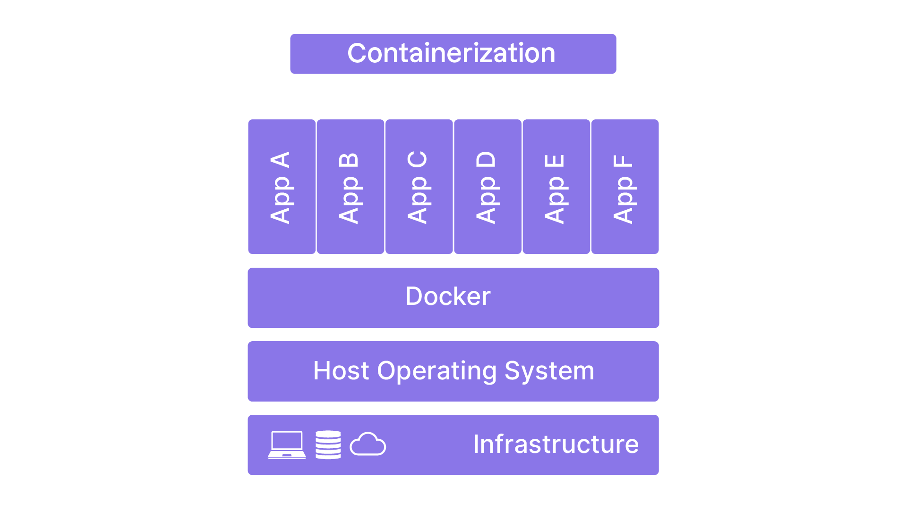

# Différence entre la virtualisation et la conteneurisation

## La virtualisation

La virtualisation repose sur un **hyperviseur**, un logiciel permettant de créer et gérer des machines virtuelles (VM).

### Types d’hyperviseurs

#### Hyperviseur de type 1 (*Bare Metal*)

Fonctionne directement sur le matériel physique.

**Exemples :**

* VMware ESXi
* Microsoft Hyper-V
* Xen

#### Hyperviseur de type 2 (*Hosted*)

Fonctionne au-dessus d’un système d’exploitation hôte.

**Exemples :**

* VMware Workstation
* Oracle VM VirtualBox

---

## La conteneurisation

La conteneurisation permet de créer des **conteneurs**, c’est-à-dire des groupes de processus isolés partageant le même noyau du système d’exploitation.

Contrairement aux machines virtuelles, les conteneurs ne possèdent pas leur propre système d’exploitation complet. Ils sont donc plus légers et plus rapides à démarrer.

### Résumé en image

---

# Fonctionnement de la conteneurisation

Les conteneurs sont gérés par des **moteurs de conteneurisation** comme Docker.

Ces moteurs utilisent des fonctionnalités du noyau Linux telles que :

* les **cgroups**
* les **namespaces**

---

## C’est quoi Docker ?

Docker est un **moteur de conteneurisation**.

Il permet :

* de créer des conteneurs,
* de les exécuter,
* de les gérer facilement.

---

# Les cgroups (*Control Groups*)

Les **cgroups** sont une fonctionnalité du noyau Linux permettant de :

* limiter,
* prioriser,
* isoler

l’utilisation des ressources système :

* CPU,
* mémoire,
* disque,
* réseau.

Cette fonctionnalité garantit qu’un conteneur n’utilise pas toutes les ressources de la machine.

## Fonctionnement des cgroups

### Allocation des ressources

Les cgroups permettent de définir des limites de ressources pour chaque conteneur.

**Exemple :**

* 2 Go de RAM
* 1 cœur CPU

### Priorisation

Certains conteneurs peuvent avoir un accès prioritaire aux ressources.

### Supervision

Les administrateurs peuvent surveiller la consommation des ressources et intervenir si nécessaire.

---

# Les namespaces

Les **namespaces** sont une fonctionnalité du noyau Linux permettant d’isoler des groupes de processus vis-à-vis des ressources système.

Chaque conteneur possède sa propre vue isolée du système.

## Fonctionnement des namespaces

### Isolation des processus

Un conteneur ne voit que ses propres processus.

### Isolation du système de fichiers

Chaque conteneur possède son propre système de fichiers isolé.

### Isolation réseau

Chaque conteneur peut avoir :

* ses propres interfaces réseau,
* ses propres adresses IP,
* ses propres réseaux privés.

### Isolation des points de montage

Chaque conteneur possède ses propres points de montage indépendants de l’hôte.

---

# Découverte de Docker

Docker est composé de plusieurs composants travaillant ensemble pour fournir une solution complète de conteneurisation.

---

## Docker Engine

Le **Docker Engine** est le cœur de Docker.

Il permet :

* la création,
* l’exécution,
* la gestion des conteneurs.

### Docker Daemon (`dockerd`)

Processus principal qui gère les conteneurs sur l’hôte.

Il expose une API REST.

### Docker Client (`docker`)

Interface en ligne de commande utilisée pour communiquer avec le daemon Docker.

---

## Docker Images

Les **images Docker** sont des modèles immuables contenant :

* le code,
* les bibliothèques,
* les dépendances nécessaires à une application.

Une image sert de base pour créer un conteneur.

---

## Docker Hub

**Docker Hub** est une plateforme permettant :

* de stocker des images Docker,
* de partager des images,
* de télécharger des images existantes.

C’est le registre par défaut utilisé par Docker.

---

## Docker Swarm

**Docker Swarm** est un outil d’orchestration de conteneurs.

Il permet de gérer plusieurs machines Docker comme un seul cluster.

### Avantages

* déploiement à grande échelle,
* gestion simplifiée,
* orchestration des conteneurs,
* haute disponibilité.
